# Gorberry Collage

**Gorberry Collage** is a Kotlin Multiplatform layout engine for image groups in chats, reviews, feeds, product media blocks, return and dispute flows, moderation tools, and other interfaces where several images need to fit into limited space.

The library computes a compact and readable collage geometry from image metadata and layout constraints. You give it the original image sizes, a target width, optional height limits, and display preferences. It returns a platform-independent layout model that describes where each tile should be placed and how image content should be fitted inside it.

Gorberry Collage does not load, decode, cache, or render images. This is intentional. The core is UI-agnostic and image-loader-agnostic, so it can be rendered with Jetpack Compose, Android Views, SwiftUI, UIKit, HTML/CSS, Canvas, or any other UI layer.

The repository currently contains samples for **Android**, **iOS**, and **Web**.

---

## Why this exists

Image groups are common in business applications, but real user images are rarely ideal. They can be portrait, landscape, square, ultra-wide, ultra-tall, screenshots, document photos, product photos, defect photos, or evidence photos in support and return flows.

Simple fixed grids often fail on these inputs. They can crop important content, create unreadable thumbnails, leave too much empty space, make media blocks too tall, or behave differently on different platforms.

Gorberry Collage was built as a shared geometry engine instead of a platform-specific UI widget. The same layout logic can be used on Android, iOS, and Web, while each platform keeps its native rendering stack.

The main product goal is simple:

> Help users understand a group of images faster without opening every image separately.

---

## Preview

Screenshots from Android, iOS, and Web samples will be added before the first public release.

### Android

| Mixed orientations | Extreme aspect ratios |
|---|---|
| 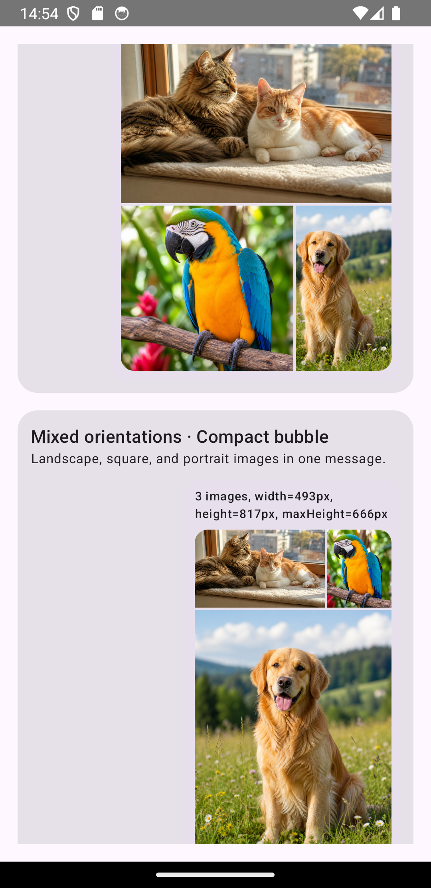 | 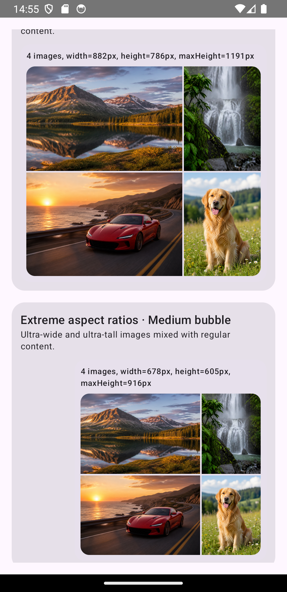 |

| CoverOnly + zero spacing | Long media group with overflow |
|---|---|
| 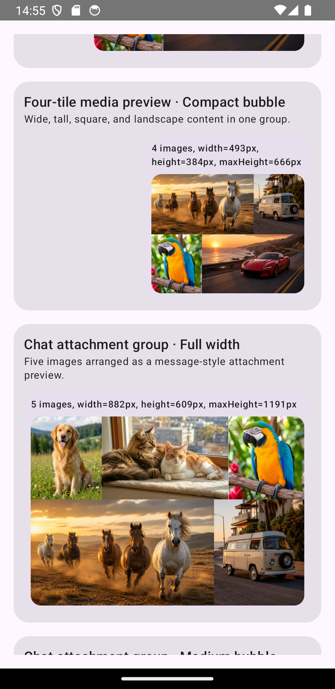 | 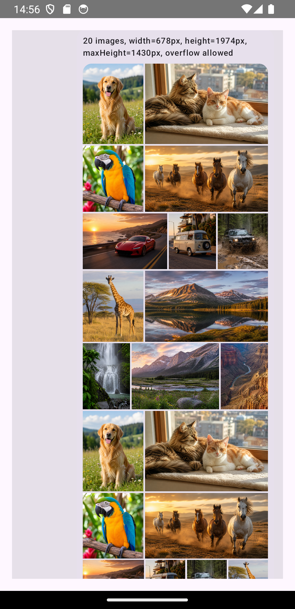 |

### iOS

| Mixed orientations | Extreme aspect ratios |
|---|---|
| 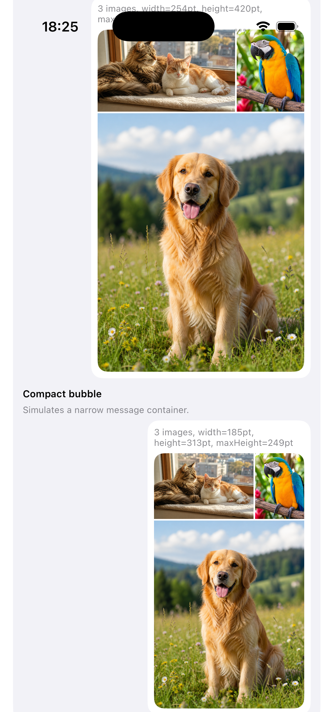 | 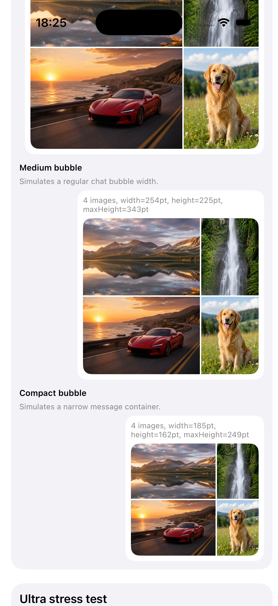 |

| CoverOnly + zero spacing | Long media group with overflow |
|---|---|
| 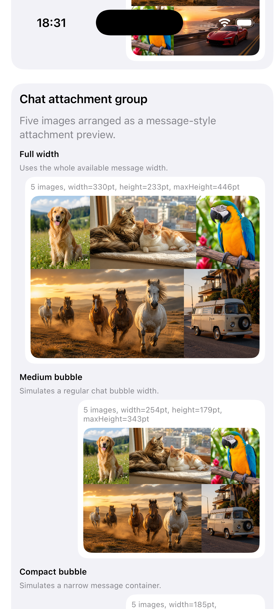 | 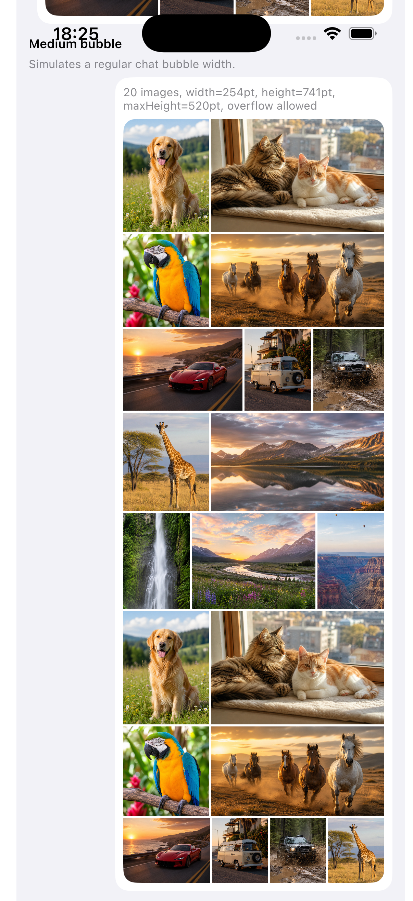 |

### Web

| Mixed orientations | Extreme aspect ratios |
|---|---|
| 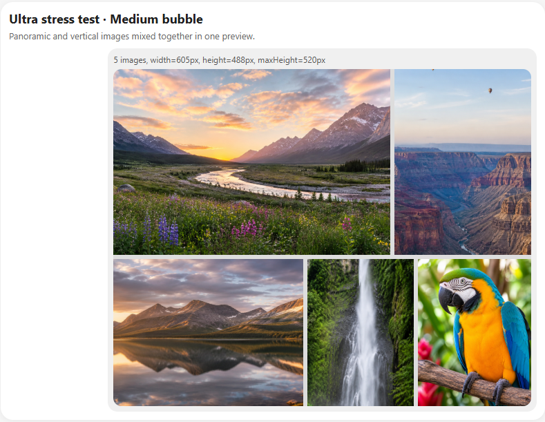 | 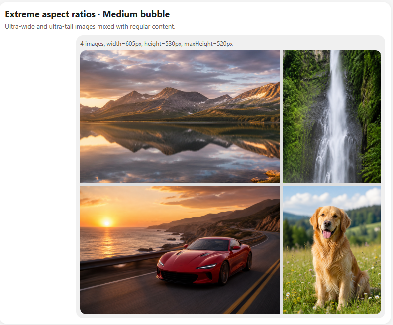 |

| CoverOnly + zero spacing | Long media group with overflow |
|---|---|
| 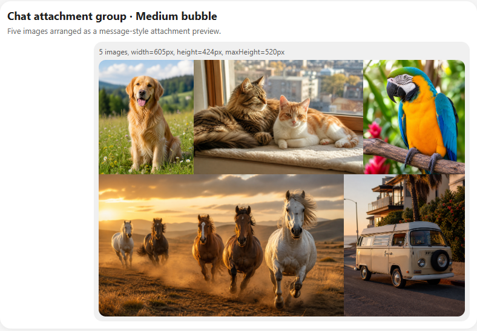 | 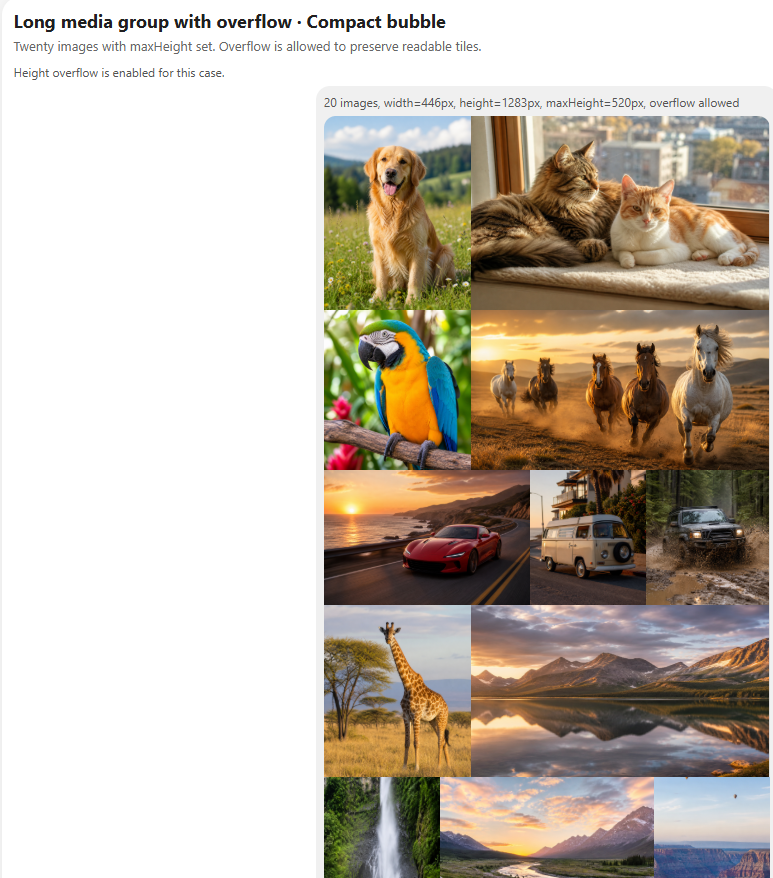 |


---

## Features

Gorberry Collage provides a shared layout core that can be reused across platforms and product surfaces.

It preserves the input order of images, supports mixed aspect ratios, adapts row composition to the target container width, and returns explicit geometry for rendering. It supports both automatic `COVER` / `CONTAIN` decisions and `CoverOnly` mode for dense previews without internal empty areas.

The engine can be configured with spacing, minimum tile sizes, maximum tiles per row, maximum landscape like tiles per row, search quality, and optional height constraints. For long media groups, it can also allow height overflow when preserving readable tiles is more important than strictly fitting into a preview height.

The core library has no dependency on Coil, Glide, SwiftUI, UIKit, Compose, React, or any other rendering or image loading technology.

---

## Current distribution status

Published artifacts are not available yet.

Planned distribution:

```text
Android / Kotlin Multiplatform -> Maven Central
iOS / Swift                    -> Swift Package Manager with XCFramework
Web / JavaScript               -> npm package
```

Until artifacts are published, use the source-based setup described below.

---

## Running samples from source

### Android

```bash
./gradlew :samples:android:assembleDebug
```

On Windows:

```powershell
.\gradlew :samples:android:assembleDebug
```

The Android sample is a Jetpack Compose app. It uses Coil for image rendering. The core library itself does not depend on Coil.

### iOS

Open the Xcode project:

```text
samples/ios/GorberryCollageSample/GorberryCollageSample.xcodeproj
```

The iOS sample uses Kotlin Multiplatform direct integration. Xcode runs the Gradle task below from a Run Script build phase:

```bash
./gradlew :collage:embedAndSignAppleFrameworkForXcode
```

This setup is intended for contributors and local sample development. It lets the iOS sample always use the current Kotlin source code.

External iOS consumers should use Swift Package Manager after the release artifact is published.

### Web

```bash
./gradlew :samples:web:jsBrowserDevelopmentRun
```

On Windows:

```powershell
.\gradlew :samples:web:jsBrowserDevelopmentRun
```

The Web sample is a Kotlin/JS browser app. It renders the layout with regular DOM and CSS.

If Kotlin/JS tries to download Yarn and your network blocks GitHub release assets, add this to `gradle.properties`:

```properties
kotlin.js.yarn=false
```

---

## Using the library from source

### Android project in the same repository

```kotlin
dependencies {
    implementation(project(":collage"))
}
```

### Android project in another repository

Use a Gradle composite build:

```kotlin
// settings.gradle.kts of the consuming project
includeBuild("../gorberry-collage") {
    dependencySubstitution {
        substitute(module("ru.wildberries:gorberry-collage"))
            .using(project(":collage"))
    }
}
```

Then use the future coordinates locally:

```kotlin
dependencies {
    implementation("ru.wildberries:gorberry-collage:0.1.0-SNAPSHOT")
}
```

### iOS project from local sources

For local development, use the included iOS sample. If you need to test a consuming Xcode app before SwiftPM publication, build a local XCFramework on macOS:

```bash
./gradlew :collage:assembleGorberryCollageDebugXCFramework
```

The generated framework is placed under:

```text
collage/build/XCFrameworks/debug/GorberryCollage.xcframework
```

For a release build:

```bash
./gradlew :collage:assembleGorberryCollageReleaseXCFramework
```

### Web project from local sources

The current Web integration is demonstrated by `samples/web`.

The public npm package is planned, but not published yet.

---

## Planned installation after release

### Android / Kotlin Multiplatform

```kotlin
repositories {
    mavenCentral()
}

dependencies {
    implementation("ru.wildberries:gorberry-collage:0.1.0")
}
```

For Kotlin Multiplatform:

```kotlin
kotlin {
    sourceSets {
        commonMain.dependencies {
            implementation("ru.wildberries:gorberry-collage:0.1.0")
        }
    }
}
```

### iOS / Swift

```swift
.package(
    url: "https://github.com/wildberries-tech/gorberry-collage",
    from: "0.1.0"
)
```

The Swift Package will point to a prebuilt `GorberryCollage.xcframework.zip` uploaded to a GitHub Release.

### Web / JavaScript

An npm package is planned. The exact public JavaScript / TypeScript API may change before the first Web release.

---

## Basic Kotlin usage

```kotlin
import ru.wildberries.collage.CollageEngine
import ru.wildberries.collage.SearchQuality
import ru.wildberries.collage.model.CollageImage
import ru.wildberries.collage.model.TileFitPolicy

val engine = CollageEngine {
    spacing = 6f
    minTileWidth = 42f
    minTileHeight = 42f
    maxTilesPerRow = 4
    maxLandscapeTilesPerRow = 2
    searchQuality = SearchQuality.Balanced
    tileFitPolicy = TileFitPolicy.CoverOnly
}

val images = listOf(
    CollageImage(imageId = 1, width = 1536f, height = 1024f),
    CollageImage(imageId = 2, width = 1254f, height = 1254f),
    CollageImage(imageId = 3, width = 1122f, height = 1402f),
)

val layout = engine.layout(
    images = images,
    width = 360f,
    minHeight = 0f,
    maxHeight = 520f,
)
```

The width is fixed because it normally comes from the parent UI container: a chat bubble, feed card, review block, grid cell, or product media section.

The height is produced by the engine and can be constrained with `minHeight` and `maxHeight`.

---

## Layout model

The engine returns a `CollageLayout`:

```kotlin
data class CollageLayout(
    val width: Float,
    val height: Float,
    val rows: List<CollageRow>,
)
```

Each row contains tiles:

```kotlin
data class CollageTile(
    val imageId: Int,
    val box: CollageBox,
    val contentBox: CollageBox,
    val scale: Float,
    val fit: TileFit,
    val cropRatio: Float,
)
```

The most important part is the difference between `box` and `contentBox`.

`box` is the visible tile viewport. UI code should clip image content to this rectangle.

`contentBox` is the scaled image rectangle in the same collage coordinate system. In `COVER` mode, `contentBox` can be larger than `box`. In `CONTAIN` mode, `contentBox` fits inside `box` and may leave empty areas.

This contract is the same on Android, iOS, and Web.

---

## Android rendering example

```kotlin
@Composable
fun CollageTileImage(
    tile: CollageTile,
) {
    val density = LocalDensity.current
    val box = tile.box
    val contentBox = tile.contentBox

    Box(
        modifier = Modifier
            .offset(
                x = with(density) { box.x.toDp() },
                y = with(density) { box.y.toDp() },
            )
            .size(
                width = with(density) { box.width.toDp() },
                height = with(density) { box.height.toDp() },
            )
            .clipToBounds(),
    ) {
        AsyncImage(
            model = tile.imageId,
            contentDescription = null,
            contentScale = ContentScale.FillBounds,
            modifier = Modifier
                .offset(
                    x = with(density) { (contentBox.x - box.x).toDp() },
                    y = with(density) { (contentBox.y - box.y).toDp() },
                )
                .requiredSize(
                    width = with(density) { contentBox.width.toDp() },
                    height = with(density) { contentBox.height.toDp() },
                ),
        )
    }
}
```

`requiredSize` is important. In `COVER` mode, the image content may be larger than the visible tile viewport and must be clipped by the parent tile.

---

## SwiftUI rendering example

```swift
struct CollageTileView: View {
    let tile: CollageTile
    let image: UIImage

    var body: some View {
        let box = tile.box
        let contentBox = tile.contentBox

        ZStack(alignment: .topLeading) {
            Image(uiImage: image)
                .resizable()
                .frame(
                    width: CGFloat(contentBox.width),
                    height: CGFloat(contentBox.height)
                )
                .offset(
                    x: CGFloat(contentBox.x - box.x),
                    y: CGFloat(contentBox.y - box.y)
                )
        }
        .frame(
            width: CGFloat(box.width),
            height: CGFloat(box.height),
            alignment: .topLeading
        )
        .clipped()
        .position(
            x: CGFloat(box.x + box.width / 2),
            y: CGFloat(box.y + box.height / 2)
        )
    }
}
```

---

## Web rendering example

```ts
function renderTile(tile, imageUrl) {
  const tileElement = document.createElement("div");

  tileElement.style.position = "absolute";
  tileElement.style.left = `${tile.box.x}px`;
  tileElement.style.top = `${tile.box.y}px`;
  tileElement.style.width = `${tile.box.width}px`;
  tileElement.style.height = `${tile.box.height}px`;
  tileElement.style.overflow = "hidden";

  const image = document.createElement("img");

  image.src = imageUrl;
  image.style.position = "absolute";
  image.style.left = `${tile.contentBox.x - tile.box.x}px`;
  image.style.top = `${tile.contentBox.y - tile.box.y}px`;
  image.style.width = `${tile.contentBox.width}px`;
  image.style.height = `${tile.contentBox.height}px`;
  image.style.objectFit = "fill";

  tileElement.appendChild(image);

  return tileElement;
}
```

---

## Fit policy

By default, Gorberry Collage uses `CoverOnly` mode

```kotlin
tileFitPolicy = TileFitPolicy.CoverOnly
```

In CoverOnly mode, every tile is rendered as COVER: image content fills the whole tile viewport, and there are no internal empty areas inside tiles. This is a good default for compact media previews in chats, feeds, reviews, and attachment groups.

If your product scenario prefers preserving the full image content even when empty areas may appear inside a tile, use Auto:

```kotlin
val engine = CollageEngine {
    tileFitPolicy = TileFitPolicy.Auto
}
```

In Auto mode, the engine chooses between COVER and CONTAIN for each tile.

For dense previews without gaps between tiles and without internal empty areas, combine CoverOnly with zero spacing:

```kotlin
val engine = CollageEngine {
    spacing = 0f
    tileFitPolicy = TileFitPolicy.CoverOnly
}
```

`spacing = 0f` removes gaps between adjacent tiles and rows.

`CoverOnly` removes empty areas inside tiles by always filling the tile viewport. It can crop image content, so it is best for compact previews where visual density is more important than showing every pixel.

---

## Height constraints

The engine uses a fixed target width and flexible height bounds.

```kotlin
val layout = engine.layout(
    images = images,
    width = containerWidthPx,
    minHeight = 0f,
    maxHeight = 520f,
)
```

This means:

```text
Use exactly this width.
Choose the resulting height, but try to keep it between minHeight and maxHeight.
```

For long media groups, strict height limits can make tiles too small. In those cases, overflow can be allowed:

```kotlin
val engine = CollageEngine {
    allowHeightOverflow = true
}
```

With `allowHeightOverflow = true`, `maxHeight` becomes a soft planning constraint. The engine can return a taller layout if that is needed to preserve readable tiles.

---

## Performance notes

Gorberry Collage measures only layout geometry. It does not load images and does not render UI.

When measuring performance, separate these concerns:

1. layout calculation time;
2. image loading and decoding time;
3. UI rendering and scrolling performance.

For production integrations, calculate the layout when the container width and image metadata are known, then render the returned geometry using the platform image pipeline.

---

## Publishing plan

The project is prepared for three distribution channels:

```text
Android / Kotlin Multiplatform -> Maven Central
iOS / Swift -> SwiftPM + XCFramework from GitHub Release
Web / JavaScript -> npm package
```

These artifacts are not published yet.

---

## Authorship

Gorberry Collage is developed as an open-source Wildberries project.

Initial design, algorithm, and implementation by **Ivan Gorbunov**.

GitHub: [EktomoB](https://github.com/EktomoB)

---

## License
Gorberry Collage is licensed under the Apache License, Version 2.0.
See [LICENSE](LICENSE) for details.
